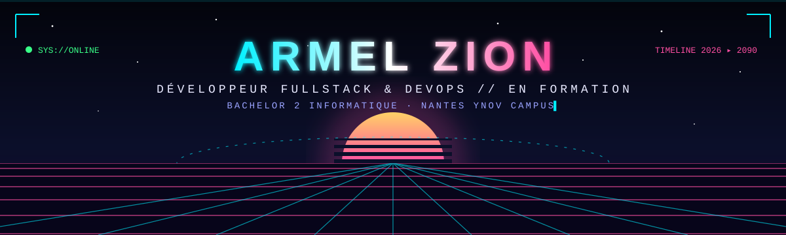

 

 

## `01` ▸ Protocole de présentation

> De l'électronique au développement logiciel : je comprends une application **de bout en bout**, du matériel et du réseau jusqu'au code.

- 🛰️ **Parcours** — BTS Systèmes électroniques et informatiques → 1re année de cycle ingénieur → Bachelor Informatique à Nantes Ynov Campus (**B1 validé avec mention Bien**)
- ⚡ **Aujourd'hui** — je développe des applications avec **React, TypeScript et Python/FastAPI**
- 🔭 **En cours de chargement** — mise en production : **Linux, Docker, CI/CD, cloud**
- 🧪 **Laboratoire perso** — [**DevWrapped**](https://github.com/Armel-zion/devwrapped) : transformer un profil GitHub en carte partageable (FastAPI + React/TypeScript)

## `02` ▸ Arsenal technologique

<b>Maîtrisé</b>  

<b>En formation cette année</b>  

## `03` ▸ Missions accomplies

| Mission | Stack | Ma contribution |
|:--|:--|:--|
| 🚢 [**Bataille navale**](https://github.com/Emerick2/Bataille-navale) Jeu multijoueur au tour par tour · équipe de 3 | `React` `TypeScript` `React Router` | Routage et navigation, design partagé, pages d'accueil et de création de partie, revue de pull requests |
| 🗝️ [**Carte blanche**](https://github.com/Emerick2/Carte-blanche) API d'un escape game · équipe de 3 · en cours | `Python` `FastAPI` `Pydantic` | Classes `Histoire` et `Chapitre`, routes `/histoire` avec gestion des erreurs 404 |
| 🐝 **TalkToBee** Rencontres linguistiques · Ydays · 17/20 | `.NET 10` `SQL` `JWT/OAuth` `GitHub Actions` `Azure` | Participation au développement en équipe, MVP présenté devant un jury |
| 💬 [**Forum**](https://github.com/WayeNot/forum-project) Application web complète · équipe de 3 · 16,5/20 | `Go` `SQLite` `JavaScript` `Docker` | 1er contributeur : cahier des charges, structure du projet Go, migrations SQLite, sessions, **conteneurisation Docker** (Dockerfile multi-stage + docker-compose) |
| 🎯 **Hangman Web** Jeu du pendu · 18,57/20 | `Go` `HTML/CSS` | Serveur web, requêtes GET/POST |

## `04` ▸ Trajectoire

## `05` ▸ Canal de communication

  

`// fin de transmission — prochaine mise à jour à chaque module terminé`

